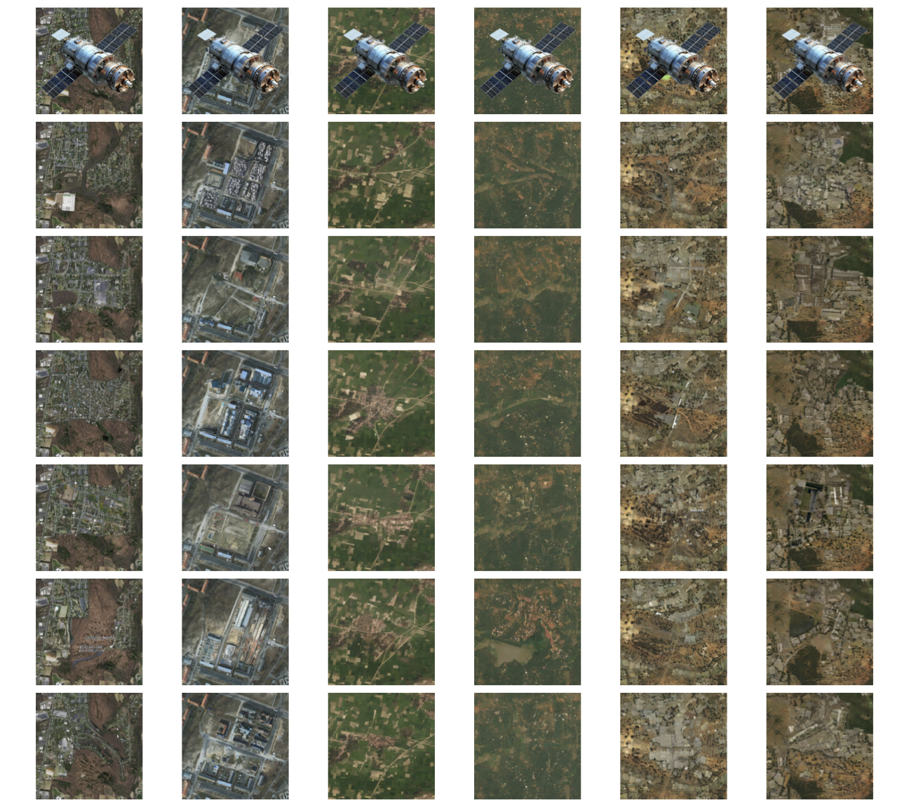
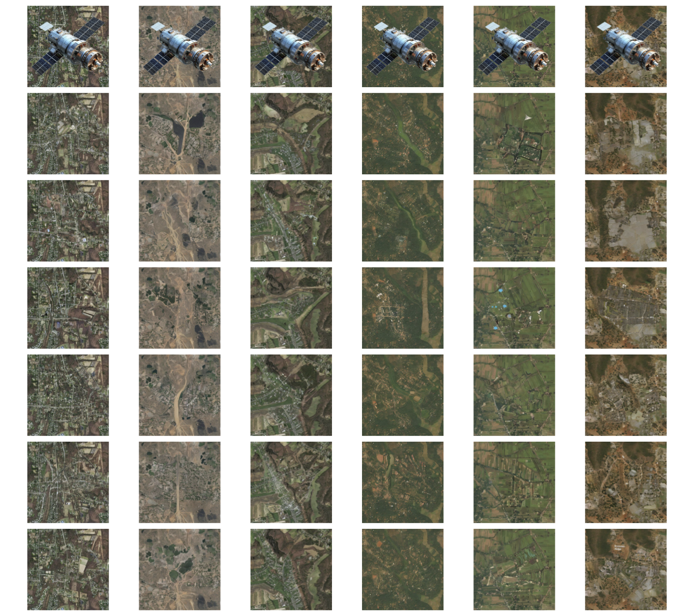
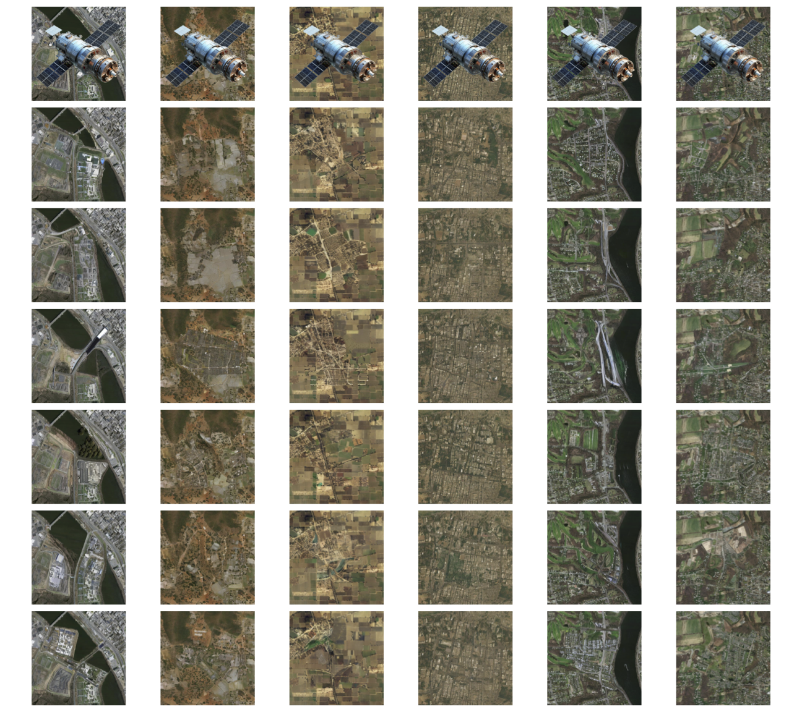
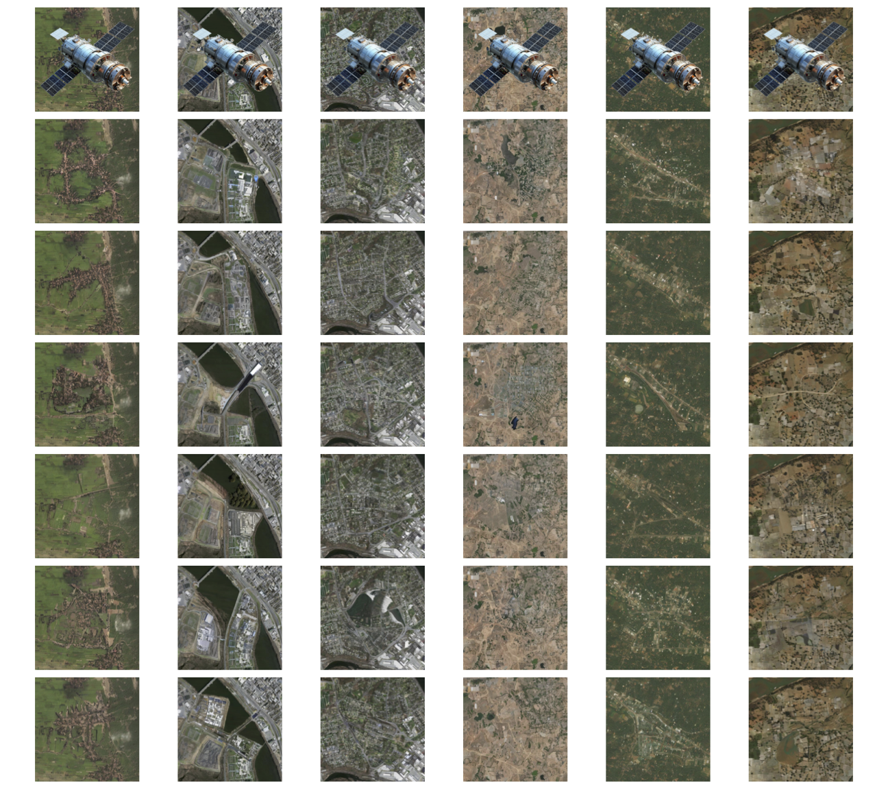
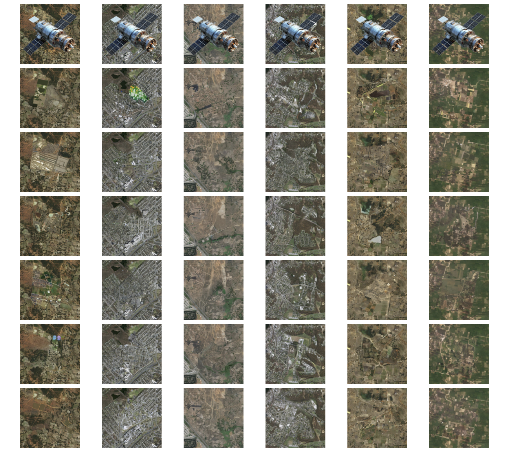
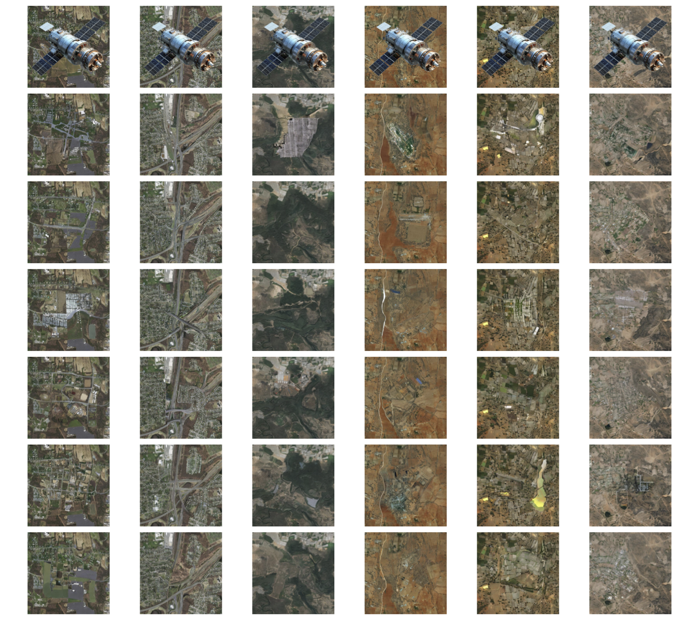

# 🛰️ KAO: Kernel-Adaptive Optimization in Diffusion for Satellite Image

**Author:** [Teerapong Panboonyuen](https://kaopanboonyuen.github.io)  
**Affiliation:** Chulalongkorn University  
**DOI:** [10.1109/TGRS.2025.3621738](https://doi.org/10.1109/TGRS.2025.3621738)

---

## 🎉 Publication

> 🏅 **Accepted in [IEEE Transactions on Geoscience and Remote Sensing (TGRS)](https://ieeexplore.ieee.org/document/11204656/)**  
> 📈 *Impact Factor: 8.6*  
> 🗓️ *2025*

---

## 🌐 Project Page

🔗 [**Visit the Project Page →**](https://kaopanboonyuen.github.io/KAO/)  
📄 PDF — [https://ieeexplore.ieee.org/document/11204656/](https://ieeexplore.ieee.org/document/11204656/)  
💻 Code — [https://github.com/kaopanboonyuen/KAO](https://github.com/kaopanboonyuen/KAO)

---

## 🖼️ Visual Overview

<p align="center">
  
  <br>
  <em>KAO demonstrates superior restoration across various occlusion patterns compared to seven baselines.</em>
</p>

<p align="center">
  
  <br>
  <em>Detailed comparisons — KAO excels in reconstructing linear features and fine urban textures.</em>
</p>

---

## 🧠 Abstract

Satellite image inpainting is a crucial task in remote sensing, where accurately restoring missing or occluded regions is essential for robust image analysis.  
In this paper, we propose **KAO**, a novel framework that utilizes **Kernel-Adaptive Optimization** within **diffusion models** for satellite image inpainting.  

KAO is specifically designed to address the challenges posed by **very high-resolution (VHR)** satellite datasets such as *DeepGlobe* and the *Massachusetts Roads Dataset*.  

Unlike existing methods that rely on preconditioned models requiring extensive retraining or postconditioned models with significant computational overhead, **KAO introduces a Latent Space Conditioning approach**, optimizing a compact latent space for efficient and accurate inpainting.  

Additionally, **Explicit Propagation** is incorporated into the diffusion process, enabling forward-backward fusion to enhance stability and precision.  

🚀 Experimental results demonstrate that **KAO sets a new benchmark** for VHR satellite image restoration — providing a scalable, high-performance solution that balances efficiency and flexibility.

---

## 🧩 Keywords

`Satellite Image Inpainting` · `Diffusion Models` · `Kernel-Adaptive Optimization` · `Remote Sensing` · `Very High-Resolution (VHR) Imagery`

---

## 📊 Results Overview

| Dataset | Description | Result |
|----------|--------------|---------|
| **Scene 1** | Urban satellite reconstruction |  |
| **Scene 2** | Agricultural pattern restoration |  |
| **Scene 3** | Heavy cloud occlusion recovery |  |
| **Scene 4** | Semi-urban environment reconstruction |  |
| **Scene 5** | Multi-resolution restoration |  |
| **Scene 6** | Structural fidelity zoom-in |  |

---

## Results

### Table I — Quantitative Comparison

| Method | FID ↓ (MA) | Prec ↑ | Recall ↑ | FID ↓ (DG) | Prec ↑ | Recall ↑ |
|--------|-----------|--------|---------|-----------|--------|---------|
| Stable Diffusion | 6.98 | 0.59 | 0.69 | 5.62 | 0.51 | 0.44 |
| RePaint | 6.12 | 0.65 | 0.71 | 5.19 | 0.59 | 0.47 |
| LatentPaint | 4.44 | 0.71 | 0.81 | 2.55 | 0.61 | 0.51 |
| SatDiff | 3.99 | 0.88 | 0.86 | 1.98 | 0.80 | 0.55 |
| DPS | 3.67 | 0.89 | 0.87 | 1.76 | 0.82 | 0.56 |
| PSLD | 3.42 | 0.91 | 0.89 | 1.65 | 0.84 | 0.58 |
| **KAO (Ours)** | **3.11** | **0.93** | **0.91** | **1.42** | **0.88** | **0.63** |

*MA = Massachusetts Roads Dataset, DG = DeepGlobe 2018*

### Table II — Ablation Study

| Configuration | LPIPS ↓ | FID ↓ |
|---------------|---------|-------|
| KAO w/o Resampling | 0.528 | 13.28 |
| KAO w/ LSC only | 0.297 | 11.44 |
| KAO w/ Single EP Module | 0.118 | 8.93 |
| **KAO — Full Model (2 EP Modules)** | **0.059** | **6.13** |

---

## Repository Structure

```
KAO/
├── kao/
│   ├── __init__.py          # Package exports
│   ├── model.py             # KAO model (Section III-C, III-D, Algorithm 1)
│   │                        #   ├── GaussianRBFKernel   (Eq. 8)
│   │                        #   ├── TokenPyramidTransformer (Appendix IV-C)
│   │                        #   ├── LatentSpaceConditioning (Appendix)
│   │                        #   ├── ExplicitPropagation  (Appendix)
│   │                        #   └── KAO                  (Algorithm 1)
│   ├── diffusion.py         # Diffusion process (Section III-A, III-B)
│   │                        #   ├── Forward process (Eq. 3, 6)
│   │                        #   ├── Reverse process (Eq. 7)
│   │                        #   ├── KAO loss (Eq. 9)
│   │                        #   └── p_sample_loop (Algorithm 1)
│   └── metrics.py           # Evaluation metrics (Section IV-C, Table I & II)
│                            #   ├── FID, Precision, Recall
│                            #   ├── LPIPS, PSNR, SSIM
│                            #   └── High Structural Variance (Eq. in III-C)
├── datasets/
│   ├── __init__.py
│   └── satellite.py         # Dataset loaders (Section IV-B)
│                            #   ├── MassachusettsRoadsDataset
│                            #   ├── DeepGlobeDataset
│                            #   └── Masking strategy (Appendix)
├── scripts/
│   ├── train.py             # Training (Appendix — Training Setup)
│   ├── evaluate.py          # Full evaluation (Table I)
│   └── ablation.py          # Ablation study (Table II)
├── configs/
│   ├── massachusetts.yaml   # Massachusetts Roads config
│   └── deepglobe.yaml       # DeepGlobe 2018 config
├── requirements.txt
└── README.md
```

---

## Installation

```bash
git clone https://github.com/kaopanboonyuen/KAO.git
cd KAO
pip install -r requirements.txt
```

---

## Quick Start

### Training

```bash
# Massachusetts Roads Dataset (Table I, left)
python scripts/train.py \
  --dataset massachusetts \
  --data_root /path/to/massachusetts_roads \
  --batch_size 16 \
  --lr 5e-5 \
  --total_iters 250000 \
  --output_dir checkpoints/massachusetts

# DeepGlobe 2018 Dataset (Table I, right)
python scripts/train.py \
  --dataset deepglobe \
  --data_root /path/to/deepglobe \
  --mask_type irregular \
  --output_dir checkpoints/deepglobe
```

### Evaluation

```bash
python scripts/evaluate.py \
  --checkpoint checkpoints/massachusetts/kao_massachusetts_iter0250000.pt \
  --dataset massachusetts \
  --data_root /path/to/massachusetts_roads \
  --save_images \
  --output_dir results/massachusetts
```

### Ablation Study (Table II)

```bash
python scripts/ablation.py --num_samples 256 --image_size 256
```

### Python API

```python
import torch
from kao import KAO, KAODiffusion

# Instantiate full model (Table II — "Two Propagation Modules")
model     = KAO(in_channels=3, latent_channels=256, num_ep_modules=2)
diffusion = KAODiffusion(num_timesteps=1000, schedule="cosine")

# Inpaint a masked satellite image
x_cond = torch.randn(1, 3, 256, 256)   # known regions
mask   = (torch.rand(1, 1, 256, 256) > 0.5).float()  # 1=known

result = diffusion.p_sample_loop(
    model  = model,
    x_cond = x_cond * mask,
    mask   = mask,
    shape  = (1, 3, 256, 256),
)
```

---

## Algorithm 1 — KAO Denoising Loop

```
Require: Diffusion model (μ_θ, Σ_θ), satellite image x_0, T, mask m
x_T ← N(0, I)
for t from T to 1 do
  Step 1 [p-sample]: x_{t-1}^infr ~ N(μ_θ(x_t), Σ_θ(x_t))
  Step 2 [q-sample]: x_{t-1}^cond ~ N(μ_q(x_0), Σ_q(x_0))
  Step 3 [Post-conditioning via KAO + TPT]:
    for h in latent tokens H do
      h* ← h^infr ⊙ (1-D(m)) + h^cond ⊙ D(m)   [LSC]
      ĥ  ← TPT_γ⁻¹[φ[ω; TPT_γ(D(m), h^cond)]]   [EP]
  Step 4 [Reconstruction]:
    x_{t-1} ← x_{t-1}^infr ⊙ (1-m) + x_{t-1}^cond ⊙ m
return x_0
```

---

## Datasets

### Massachusetts Roads Dataset
- **1171** aerial RGB images, **1500×1500** pixels
- Road structure recovery, sharp thin features
- [Download](https://www.cs.toronto.edu/~vmnih/data/)

### DeepGlobe 2018
- **803** VHR satellite images at **50 cm/pixel**
- Urban, agricultural, forested land cover
- [Download](http://deepglobe.org/)

---

## 🧾 Citation (BibTeX)

```bibtex
@article{panboonyuen2025kao,
  author    = {Teerapong Panboonyuen},
  title     = {KAO: Kernel-Adaptive Optimization in Diffusion for Satellite Image},
  journal   = {IEEE Transactions on Geoscience and Remote Sensing},
  year      = {2025},
  doi       = {10.1109/TGRS.2025.3621738},
  note      = {Manuscript No. TGRS-2025-06970},
  publisher = {IEEE}
}