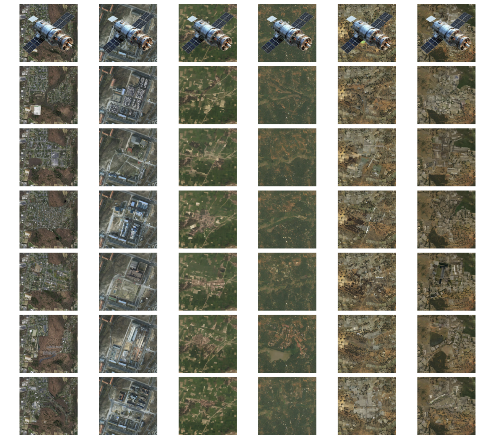

# 🛰️ KAO: Kernel-Adaptive Optimization in Diffusion for Satellite Image Inpainting

**Author:** [Teerapong Panboonyuen](https://kaopanboonyuen.github.io)  
**Affiliation:** Chulalongkorn University  
**DOI:** [10.1109/TGRS.2025.3621738](https://doi.org/10.1109/TGRS.2025.3621738)

---

## 🎉 Publication

> 🏅 **Accepted in [IEEE Transactions on Geoscience and Remote Sensing (TGRS)](https://ieeexplore.ieee.org/)**  
> 📈 *Impact Factor: 8.6*  
> 🗓️ *2025*

---

## 🌐 Project Page

🔗 [**Visit the Project Page →**](https://kaopanboonyuen.github.io/KAO/)  
📄 PDF — *Coming Soon*  
💻 Code — *Coming Soon*

---

## 🖼️ Visual Overview

<p align="center">
  
  <br>
  <em>KAO demonstrates superior restoration across various occlusion patterns compared to seven baselines.</em>
</p>

<p align="center">
  
  <br>
  <em>Detailed comparisons — KAO excels in reconstructing linear features and fine urban textures.</em>
</p>

---

## 🧠 Abstract

Satellite image inpainting is a crucial task in remote sensing, where accurately restoring missing or occluded regions is essential for robust image analysis.  
In this paper, we propose **KAO**, a novel framework that utilizes **Kernel-Adaptive Optimization** within **diffusion models** for satellite image inpainting.  

KAO is specifically designed to address the challenges posed by **very high-resolution (VHR)** satellite datasets such as *DeepGlobe* and the *Massachusetts Roads Dataset*.  

Unlike existing methods that rely on preconditioned models requiring extensive retraining or postconditioned models with significant computational overhead, **KAO introduces a Latent Space Conditioning approach**, optimizing a compact latent space for efficient and accurate inpainting.  

Additionally, **Explicit Propagation** is incorporated into the diffusion process, enabling forward-backward fusion to enhance stability and precision.  

🚀 Experimental results demonstrate that **KAO sets a new benchmark** for VHR satellite image restoration — providing a scalable, high-performance solution that balances efficiency and flexibility.

---

## 🧩 Keywords

`Satellite Image Inpainting` · `Diffusion Models` · `Kernel-Adaptive Optimization` · `Remote Sensing` · `Very High-Resolution (VHR) Imagery`

---

## 📊 Results Overview

| Dataset | Description | Result |
|----------|--------------|---------|
| **Scene 1** | Urban satellite reconstruction |  |
| **Scene 2** | Agricultural pattern restoration |  |
| **Scene 3** | Heavy cloud occlusion recovery |  |
| **Scene 4** | Semi-urban environment reconstruction |  |
| **Scene 5** | Multi-resolution restoration |  |
| **Scene 6** | Structural fidelity zoom-in |  |

---

## 🧾 Citation (BibTeX)

```bibtex
@article{panboonyuen2025kao,
  author    = {Teerapong Panboonyuen},
  title     = {KAO: Kernel-Adaptive Optimization in Diffusion for Satellite Image Inpainting},
  journal   = {IEEE Transactions on Geoscience and Remote Sensing},
  year      = {2025},
  doi       = {10.1109/TGRS.2025.3621738},
  note      = {Manuscript No. TGRS-2025-06970},
  publisher = {IEEE}
}

---